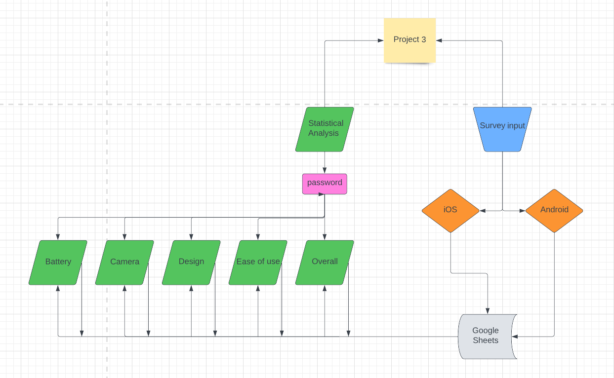
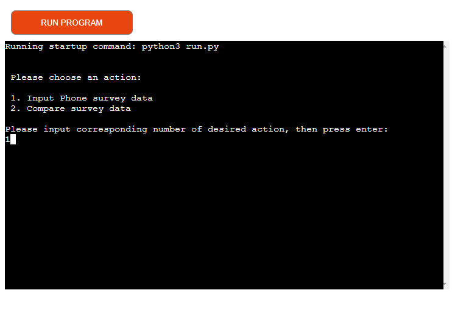
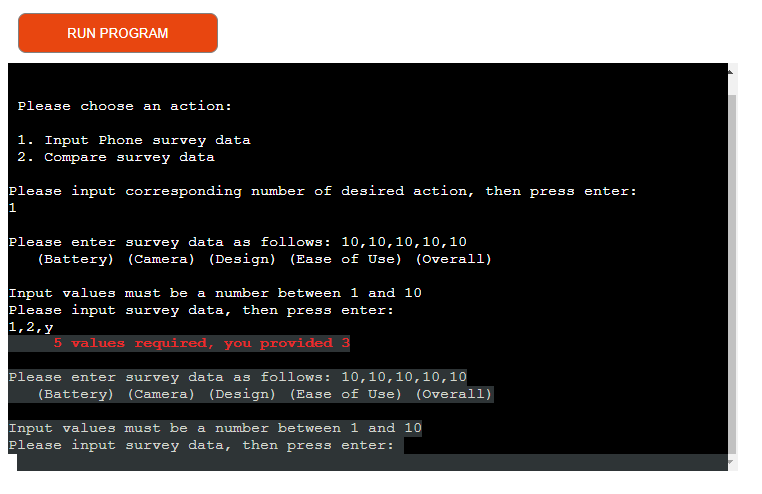
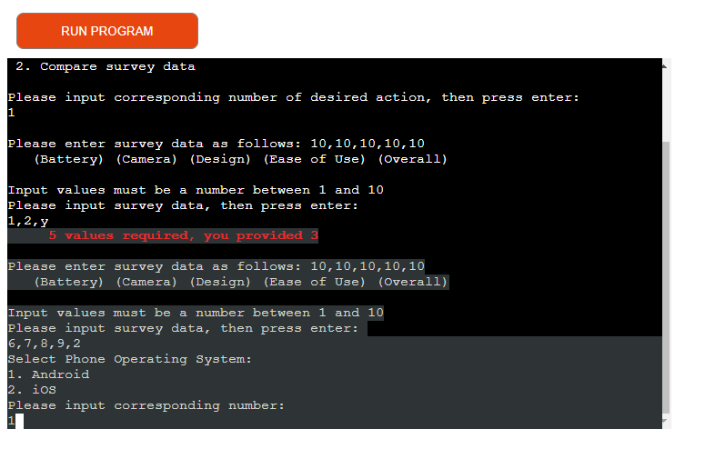
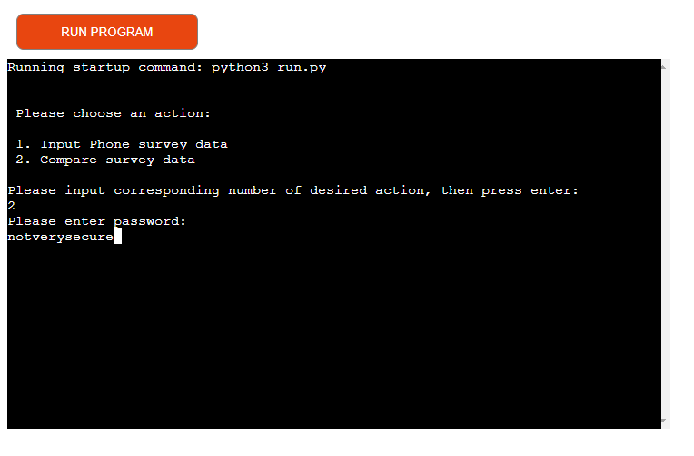
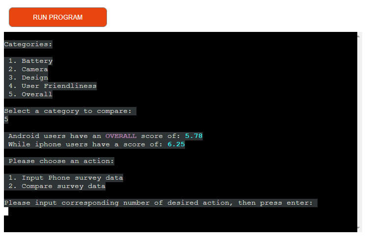
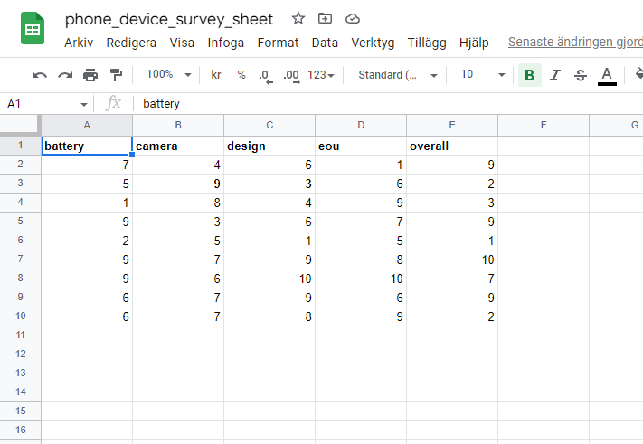
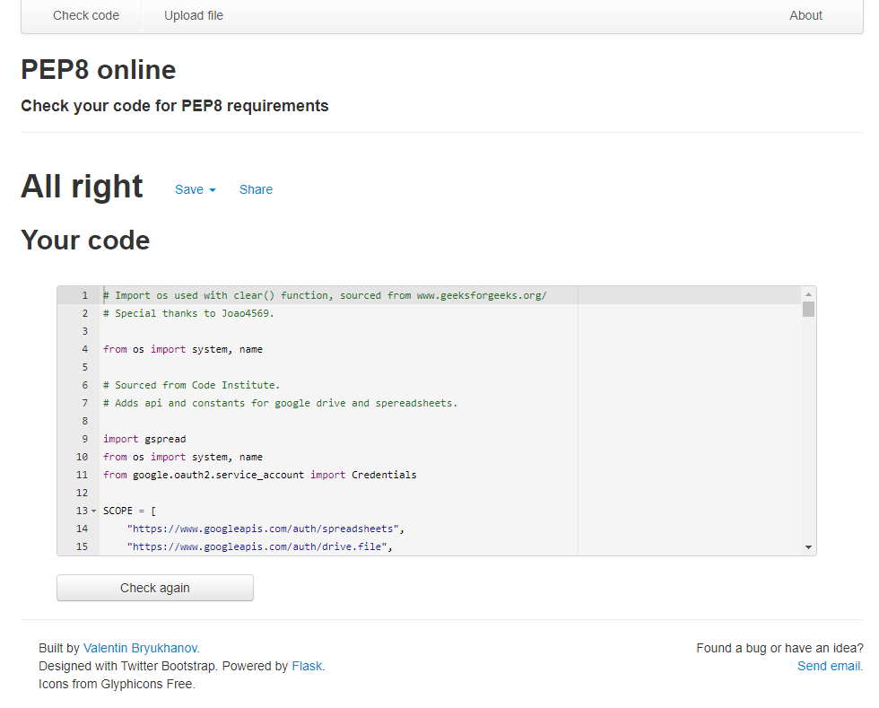

# p3-ci-phone-device-survey (Survey Data Processor)

## Content
---

* [Planning and making a Flowchart](#Planning and making a flowchart)
* [Resources and Technologies](#Resources Used)
* [The Data Processor](The Data Processor)
* [The Data Model](The Data Model)
* [Testing](Testing)
* [Deployment](Deployment)
* [Bugs](Bugs)

## Planning and making a Flowchart
---

* After a couple of botched ideas and a session with my mentor, i settled on making a survey that compares the satisfaction of Android vs iPhone users.
* I started by making a general idea of what sort of functions one could want from a survey data processor, and then made a flowchart as seen below

## Resources and Technologies
---

* Heroku
* Github
* Python
* Code Institute Template
* Google Sheets / Google cloud console
  * Connected via Google API's and Gspread 
* Lucidchart

## The Data Processor
---

### Select desired function to execute

* First screen that you will see is a menu with 2 options, capture survey data to the worksheet, and comparing survey data.

 
### Input format & handling input errors
* After selecting input phone survey data, prompts user to enter values from the surver, bad input will also be handled with error messages.

 
### Updating the survey sheet and selecting OS
* If values are entered correctly, the data processor will prompt you to select the OS which the phone is using.

### When the data has been sent
* When you've selected an OS, the data will be sent to a worksheet that matches the selected OS, and then return you to enter new survey data.
 * Reason for looping back to survey data input is, realistically, you will be doing a lot of them at the same time, saves 2 presses per survey.

### Accessing restricted data
* In order to access the sheet data, you need to give it a password.

### Clearing the menu and accessing relevant data
* As shown above, the password is not obfuscated on the screen, and that's why i chose to implement the clear() function.

### Retrieving and viewing chosen data
* Shows comparison values as an average between all surveys, highlighted relevant data.

## The data model
---

* Simple google sheets, at the moment is also used to store valid passwords, not great and will be substituted for the getpass() method.

## Testing
---

Ran it through the pep8 validator a couple of times during developement, lots of indentation and whitespace errors, all errors are resolved now

